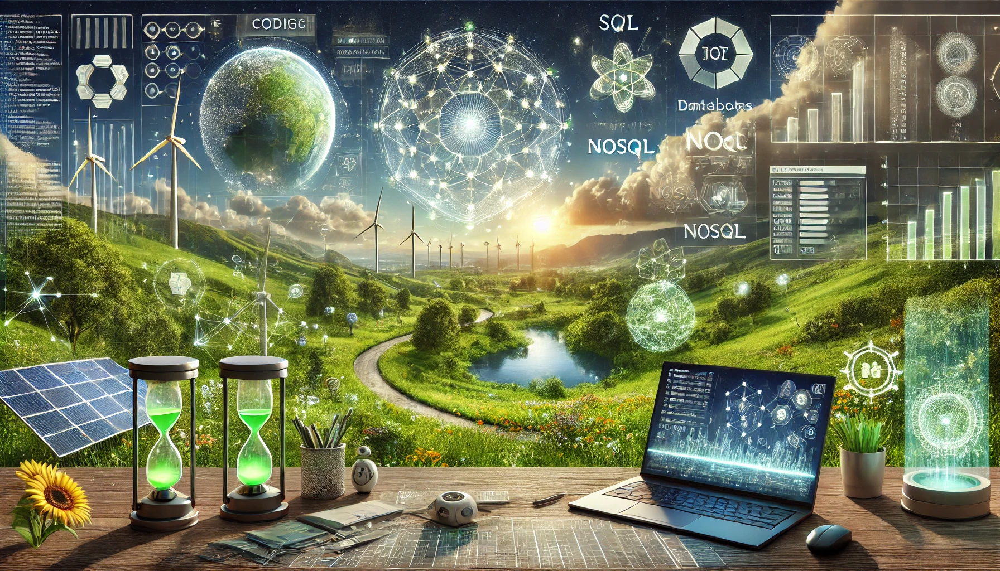

<h1 align='center'>
    Hi there, I'm Malaka S Gunawardhana 👨🏻‍🎓
</h1>

Welcome 👋 to my GitHub profile! 

⚙️🤖🍃💻🛠️

---

    

I am a passionate engineer 👨‍💻 specialising in the integration of cutting-edge 🎯 technologies 💻⚙️ such as Artificial Intelligence (AI), Machine Learning (ML), Large Language Models (LLMs), and advanced database systems 📊 (SQL and NoSQL). My expertise spans a diverse range of fields, including the Internet of Things (IoT), embedded systems, and renewable energy solutions. With a strong focus on innovation, sustainability, and creative problem-solving, I continuously strive to bridge the gap between technology 👨🏻‍🔧 and real-world applications. 💯🚀🎯

### My notable projects include:

1. 🕵 [**Crime Data Analysis of LAPD:**](https://github.com/MalakaSupun/Crime-Data-Analysis-of-LAPD) Comprehensive insights into LAPD 🚓 🚔 datasets, leveraging AI, SQL, NLP, and data analytics 👮‍♂️.
2. 🍃 [**Wind Energy Production  Forecasting:**](https://github.com/MalakaSupun/Wind-Energy-Production-Forecasting-with-Multi-variable-LSTM-Networks) Harnessing multi-variable LSTM networks for 🌿 renewable 🔌 energy 🔋 prediction.
3. 📚 [**DocWise-Assistant:**](https://github.com/MalakaSupun/DocWise-Assistant) An intelligent chatbot application powered by advanced Large Language Models (LLMs) and Retrieval-Augmented Generation (RAG) 📕 techniques.
4. 🖼️ [**Miny-Gemini-OCR**](https://github.com/MalakaSupun/Miny-Gemini-OCR) A Simple Guide to OCR (Optical Character Recognition) using the Gemma 3B Vision Language Model.
5. 🏞️ [**DynamicWalls:**](https://github.com/MalakaSupun/DynamicWalls-The-gnome-wallpaper-slider) A GNOME wallpaper 🖼️ slider enhancing desktop interactivity and 🎨 aesthetics.
6. 🤖 [**Grid-solving robot Arduino:**](https://github.com/MalakaSupun/Grid-solving-robot-Arduino-) A grid-solving robot 🦾 that can find its path in a grid and go to the location that it programs ⚙️ to do.
7. 🎮 [**Snake Game in Proteus 8.9:**](https://github.com/MalakaSupun/Snake-Game-in-Proteus-8.9) A fully-functional "Snake 🐍 Game" with a score display.
8. 🦾 [**EMG-Controlled Adaptive Wearable Robotic Exoskeleton for Upper Limb Rehabilitation:**](https://github.com/MalakaSupun/EMG-Controlled-Adaptive-Wearable-Robotic-Exoskeleton-for-Upper-Limb-Rehabilitation) This project focuses on developing a wearable 🤖 robotic exoskeleton system controlled by electromyography (EMG) signals to aid in the rehabilitation of upper limb function.

As an advocate for AI-driven solutions and sustainability, I constantly explore new frontiers in renewable energy, robotics, and intelligent systems. My creative, hands-on approach enables me to design and implement impactful solutions that blend innovation with practicality.

🎮✮ ⋆˚｡𖦹 ⋆｡°✩👾
